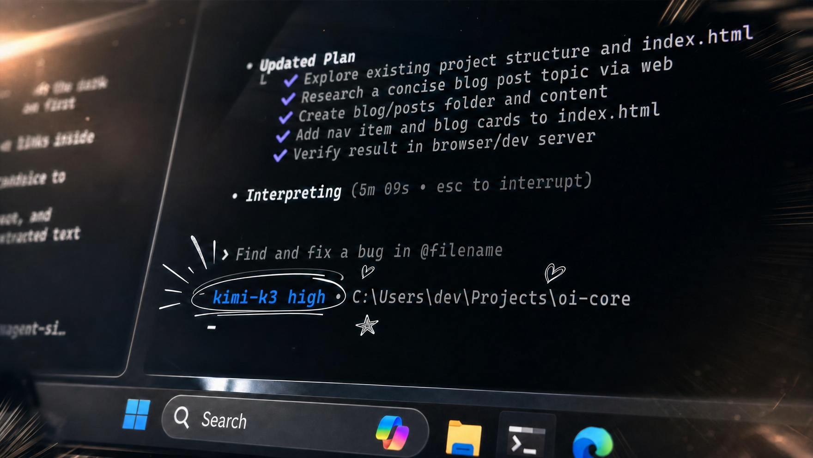

<!-- README translation source: README.md sha256=d5db2b994d859b4186348f83bf35783a86b3f79e363d0c92100dbf06707ced16 -->

<h1 align="center">Open Interpreter</h1>

<p align="center">低コストモデル向けに最適化されたコーディングエージェント。<a href="https://www.openinterpreter.com/blog/open-interpreter?utm_source=github&amp;utm_medium=referral&amp;utm_campaign=readme&amp;utm_content=hero_text"><strong>ブログ記事 ↗</strong></a></p>

<p align="center">
  <a href="README.md">English</a> • <a href="README_ES.md">Español</a> • <a href="README_ZH.md">简体中文</a> • <b>日本語</b>
</p>

<p align="center">
  <a href="https://discord.gg/Hvz9Axh84z"></a>
  <a href="https://www.openinterpreter.com/docs/terminal?utm_source=github&amp;utm_medium=referral&amp;utm_campaign=readme&amp;utm_content=docs_badge"></a>
  <a href="LICENSE"></a>
</p>

> [!NOTE]
> **本日、Kimi K3 が登場しました。** プロバイダーが推奨する
> [Kimi Code](https://www.kimi.com/coding/en) ハーネスを Rust で再実装し、
> Codex ライクなインターフェースで K3 の性能を最大限に引き出せるようにしました。
> [**Kimi ドキュメント →**](https://www.openinterpreter.com/docs/terminal/kimi-k3?utm_source=github&utm_medium=referral&utm_campaign=readme&utm_content=kimi_k3_note)

<br>

<p align="center">
  <a href="https://www.openinterpreter.com/blog/open-interpreter?utm_source=github&amp;utm_medium=referral&amp;utm_campaign=readme&amp;utm_content=hero_image">
    
  </a>
</p>

## インストール

macOS と Linux:

```bash
curl -fsSL https://www.openinterpreter.com/install | sh
```

Windows:

```powershell
irm https://www.openinterpreter.com/install.ps1 | iex
```

インストール後、ターミナルで `i` または `interpreter` と入力するとセッションが始まります。

## ハーネスエミュレーション

Open Interpreter は OpenAI の Codex のフォークであり、低コストモデルの性能を最大限に引き出すエージェントハーネスのエミュレーションに重点を置いています。

`/harness` を使うと、有効なハーネスを切り替えられます:

```text
> /harness

native
claude-code
claude-code-bare
zcode
kimi-code
kimi-cli
qwen-code
deepseek-tui
swe-agent
minimal
```

詳しくは[ハーネスのドキュメント](https://www.openinterpreter.com/docs/terminal/harness?utm_source=github&utm_medium=referral&utm_campaign=readme&utm_content=harness_docs)と[プロバイダー設定ガイド](https://www.openinterpreter.com/docs/terminal/providers?utm_source=github&utm_medium=referral&utm_campaign=readme&utm_content=provider_guides)をご覧ください。

## ACP 互換、Codex 互換

Open Interpreter は [ACP 互換のエディターやクライアント](https://agentclientprotocol.com/get-started/clients)で動作します。クライアント側で `interpreter acp` を起動するように設定してください。例は [ACP ガイド](https://www.openinterpreter.com/docs/terminal/acp)にあります。

すでに OpenAI の Codex SDK で開発していますか？ SDK はそのままに、
バイナリを 1 行で上書きできます:

```diff
-const codex = new Codex();
+const codex = new Codex({ codexPathOverride: "interpreter" });
```

Open Interpreter は Codex と同じ exec プロトコルを話します。[SDK ガイド](https://www.openinterpreter.com/docs/terminal/sdk)を参照し、`scripts/test-codex-sdk-compat.sh` を実行すると、プロバイダー不要でローカルに互換性を確認できます。

## デフォルトでポータブル

Open Interpreter は、既存のエージェント環境を Open Interpreter 専用の形式に
閉じ込めるのではなく、その中に自然に収まることを目指しています。プロダクトの
目標は、共有された、ツールに依存しない標準とディレクトリを優先し、ユーザーが
作成したデータを読みやすいファイルで保持し、他の互換エージェントとの間を
簡単に行き来できるようにすることです。

現時点では、リポジトリの `AGENTS.md`、共有の `.agents/skills` ディレクトリ、
MCP、ACP、そして Codex exec プロトコルがこれに含まれます。`~/.openinterpreter`
以下のプロダクト固有のストレージは、実用的な共有標準がまだ存在しない設定や
ランタイム状態のために予約されています。従来のプロダクト固有のスキル
ディレクトリは互換性のために引き続き読み込まれますが、新しいスキルは
`.agents/skills` または `~/.agents/skills` に置いてください。

現在の境界と、それを発展させるためのルールについては[ポータビリティガイド](docs/portability.md)をご覧ください。

## コンピュータ操作

Open Interpreter には、あらゆるモデルがインターフェースを操作・テストできる QA スキルが同梱されています。[agent-browser](https://github.com/vercel-labs/agent-browser) を使って実際のブラウザで Web アプリを操作したり、[trycua](https://github.com/trycua/cua) を使ってネイティブアプリを操作・テストしたりできます。

## 機能

- macOS、Linux、Windows のネイティブなサンドボックス内でコマンドを実行します。
- `/model` で TUI からプロバイダーとモデルを切り替えられます。
- `interpreter --chat-completions` または `interpreter exec --chat-completions` で、
  選択した任意の OpenAI 互換プロバイダーを Chat Completions 経由で実行します。
- `/harness` で Rust ネイティブのモデルハーネスを確認・切り替えできます。
- 組み込みの QA スキルで Web アプリとネイティブアプリをテストします。
- `interpreter acp` により、エディター向けの [Agent Client Protocol](https://agentclientprotocol.com/) エージェントとして動作します。
- 共有の `AGENTS.md` の指示と `.agents/skills` ディレクトリを再利用します。
- プロダクト専用の設定とセッション状態は `~/.openinterpreter` 以下にローカル保存します。
- `exec`、MCP、スキル、フック、パーミッション、`AGENTS.md` に対応しています。

## ドキュメント

- [ターミナルのドキュメント](https://www.openinterpreter.com/docs/terminal?utm_source=github&utm_medium=referral&utm_campaign=readme&utm_content=terminal_docs)
- [クイックスタート](https://www.openinterpreter.com/docs/terminal/quickstart?utm_source=github&utm_medium=referral&utm_campaign=readme&utm_content=quickstart)
- [インストールガイド](https://www.openinterpreter.com/docs/terminal/install?utm_source=github&utm_medium=referral&utm_campaign=readme&utm_content=install_guide)
- [設定](https://www.openinterpreter.com/docs/terminal/config?utm_source=github&utm_medium=referral&utm_campaign=readme&utm_content=configuration)
- [CLI リファレンス](https://www.openinterpreter.com/docs/terminal/cli-reference?utm_source=github&utm_medium=referral&utm_campaign=readme&utm_content=cli_reference)
- [ハーネス](https://www.openinterpreter.com/docs/terminal/harness?utm_source=github&utm_medium=referral&utm_campaign=readme&utm_content=harnesses)
- [モデルプロバイダーガイド](https://www.openinterpreter.com/docs/terminal/providers?utm_source=github&utm_medium=referral&utm_campaign=readme&utm_content=provider_guides)
  - [Kimi K3](https://www.openinterpreter.com/docs/terminal/kimi-k3?utm_source=github&utm_medium=referral&utm_campaign=readme&utm_content=kimi_k3_docs)
  - [DeepSeek](https://www.openinterpreter.com/docs/terminal/deepseek?utm_source=github&utm_medium=referral&utm_campaign=readme&utm_content=deepseek_docs)
  - [Z.AI、GLM、ZCode](https://www.openinterpreter.com/docs/terminal/zai-glm?utm_source=github&utm_medium=referral&utm_campaign=readme&utm_content=zai_glm_docs)
- [Agent Client Protocol](https://www.openinterpreter.com/docs/terminal/acp)
- [Codex SDK](https://www.openinterpreter.com/docs/terminal/sdk)
- [ポータビリティ](https://github.com/openinterpreter/openinterpreter/blob/main/docs/portability.md)
- [サンドボックスと承認](https://www.openinterpreter.com/docs/terminal/sandbox?utm_source=github&utm_medium=referral&utm_campaign=readme&utm_content=sandbox_approvals)
- [ディストリビューションフォークのブランディング](FORK_BRANDING.md)

プロバイダーとモデルの一覧は Rust のリストとして手動管理されるのではなく、
生成されます。`codex-rs` から、`python3 scripts/write_provider_catalog.py` を
実行するとホストされている全プロバイダーを更新できます。`--provider
<provider-id>` を繰り返し指定すれば、選択したプロバイダーのエントリだけを
更新できます。ライブのモデルソースを利用するには、[プロバイダーのドキュメント](https://www.openinterpreter.com/docs/terminal/providers?utm_source=github&utm_medium=referral&utm_campaign=readme&utm_content=provider_catalog_generation)に記載されているプロバイダーの認証情報が必要です。


> [!NOTE]
> これは Codex をベースにした Open Interpreter の新しい Rust 版です。オリジナルの Python プロジェクトをお探しですか？ コミュニティによってメンテナンスされているフォーク [endolith/open-interpreter](https://github.com/endolith/open-interpreter) として存続しています。

## ライセンス

Apache-2.0
